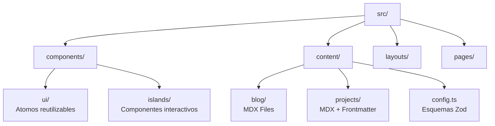

# developer-portfolio
Esta es una guía integral y estructurada para desarrollar tu portafolio, sintetizando las mejores prácticas de los documentos proporcionados y añadiendo ideas estratégicas nuevas. El objetivo es tratar tu portafolio no como un simple currículum web, sino como un **producto de software completo**.

---

# 🚀 Guía Maestra: Desarrollo de Portafolio de Desarrollador con Astro

## 1. Estrategia de Contenido y Narrativa

Antes de escribir código, debes definir qué historia cuenta tu portafolio. No es solo una colección de enlaces; es tu carta de presentación profesional.

### La Estructura "Narrativa"

Un portafolio efectivo debe funcionar como una narrativa técnica.

| Sección | Objetivo Estratégico | Contenido Clave |
| --- | --- | --- |
| **Hero (Inicio)** | Captar atención en < 3 segundos.

 | Propuesta de valor única (no genérica), foto profesional, enlaces sociales y CTA claro.

 |
| **Sobre Mí** | Contexto humano y profesional. | Filosofía de trabajo, trayectoria, soft skills y enfoque técnico (no solo hobbies).

 |
| **Proyectos** | Demostración de resolución de problemas. | 3-6 mejores proyectos. Calidad > Cantidad.

 |
| **Skills** | Honestidad técnica. | Categoriza en "Experto", "Competente" y "Aprendiendo" para mostrar madurez.

 |
| **Contacto** | Fricción cero. | Formulario funcional, email (con opción de copiar), y redes.

 |

### Estructura de un "Case Study" (Estudio de Caso)

No te limites a poner una captura y un enlace. Trata cada proyecto con profundidad:

1. 
**El Problema:** ¿Qué desafío enfrentabas?.

2. 
**La Solución:** ¿Cómo lo resolviste técnica y arquitectónicamente?.

3. 
**El Stack:** ¿Por qué elegiste esas tecnologías?.

4. 
**El Resultado (Métricas):** Cuantifica el éxito (ej. "Reducción del 40% en TTFB", "Ahorro de 50$/mes").

5. 
**Enlaces:** Repo (código limpio) y Demo en vivo.

---

## 2. Stack Tecnológico: Arquitectura de Alto Rendimiento

La elección unánime es **Astro** por su arquitectura de islas, priorizando el envío de HTML estático y "hidratando" solo lo interactivo.

### 🛠️ El "Golden Stack" Recomendado

| Capa | Tecnología | Justificación Técnica |
| --- | --- | --- |
| **Core** | **Astro 5.x** | Rendimiento excepcional, SEO nativo y Content Layer.

 |
| **Lenguaje** | **TypeScript** | Modo estricto para evitar errores y documentar el código implícitamente.

 |
| **Estilos** | **Tailwind CSS** | Desarrollo rápido, sistema de diseño consistente y ligero.

 |
| **Interactividad** | **React** o **Svelte** | React para ecosistema/compatibilidad o Svelte para menor peso del bundle.

 |
| **Contenido** | **MDX + Zod** | Escritura flexible en Markdown con validación estricta de esquemas de datos.

 |
| **Animación** | **Framer Motion** | Para micro-interacciones profesionales y transiciones complejas.

 |
| **Despliegue** | **Vercel** o **Cloudflare** | CI/CD automático, Edge functions y analíticas.

 |

---

## 3. Arquitectura del Proyecto y Código

Organiza tu código para que sea escalable y fácil de leer para otros desarrolladores que visiten tu repo.

### Estructura de Carpetas Sugerida

### Validaciones Clave (Best Practices)

* **Tipado Estricto (Zod):** Define esquemas que obliguen a que cada proyecto tenga imagen, fecha y título. Si falta algo, el build debe fallar.

* 
**Testing:** Implementa Vitest para unit testing y Playwright para pruebas E2E (ej. verificar que el formulario funciona).

* 
**Imágenes:** Usa `<Image />` de Astro y `sharp` para generar WebP/AVIF y evitar Layout Shifts.

---

## 4. Características "Wow" para Diferenciarte

Para destacar en un mercado saturado, implementa funcionalidades que demuestren nivel "Senior" o ingeniería avanzada.

### 🌟 Funcionalidades Avanzadas

1. **Command Palette (`Cmd+K`):**
* Implementa una barra de búsqueda global para navegar por proyectos, cambiar temas o copiar tu email sin usar el mouse. Demuestra enfoque en "Power Users".

2. **Open Graph (OG) Dinámico:**
* Genera automáticamente las imágenes para compartir en redes sociales usando `@vercel/og` o Satori basado en el título del post/proyecto.

3. **Server Islands (Islas de Servidor):**
* Usa el renderizado parcial de Astro para mostrar contenido dinámico (ej. tu disponibilidad actual, hora local, o canción de Spotify) sin romper el caché estático del resto de la página.

4. **Dashboard de Métricas en Vivo:**
* Conecta la API de GitHub para mostrar tus commits del último año o estrellas en repositorios en tiempo real.

5. **Modo Oscuro Persistente y sin "Flicker":**
* Usa `localStorage` y scripts en línea para evitar el parpadeo blanco al cargar la página.

### 💡 Ideas Creativas Adicionales (Nuevas)

* 
**"Easter Eggs" en Consola:** Deja un mensaje personalizado (`console.log`) para los reclutadores que inspeccionen tu sitio.

* **Página 404 Interactiva:** No uses un error genérico. Crea un mini-juego o una animación que redirija al home.

* 
**Timeline Interactivo:** Visualiza tu trayectoria con una animación controlada por el scroll (Scroll-driven animations).

---

## 5. Hoja de Ruta de Implementación

Sigue este plan paso a paso para no abrumarte:

1. **Fase 1: Setup y Estructura (Semana 1)**
* 
`npm create astro@latest`.

* Instalar Tailwind y configurar tipografías.
* Definir Colecciones de Contenido (Zod Schemas).

2. **Fase 2: Core Content (Semana 2)**
* Desarrollar Layouts y componentes UI base (Botones, Cards).
* Crear páginas estáticas: Hero, Sobre Mí.
* Redactar los Case Studies de los proyectos (Texto + Imágenes).

3. **Fase 3: Interactividad (Semana 3)**
* Implementar "Islas": Filtro de proyectos, Theme Toggle, Menú móvil.

* Añadir animaciones con Framer Motion.

4. **Fase 4: Pulido y Extras (Semana 4)**
* SEO (Sitemap, Robots.txt, Meta tags).

* Accesibilidad (Navegación por teclado, ARIA labels).

* Optimización (Lighthouse Score 100/100).

---

## 6. Checklist de Lanzamiento 🚀

Antes de hacer público tu portafolio, verifica estos puntos críticos:

* [ ] **Performance:** Puntuación Lighthouse > 95 en móvil y desktop.

* [ ] **SEO:** `robots.txt` y `sitemap.xml` generados automáticamente.

* [ ] **Seguridad:** Enlaces externos con `rel="noopener noreferrer"`.

* [ ] **Accesibilidad:** Contraste de colores WCAG AA y navegación por teclado funcional.

* [ ] **Error 404:** Página personalizada funcional.

* [ ] **Repo:** README.md profesional explicando cómo correr el proyecto localmente.
