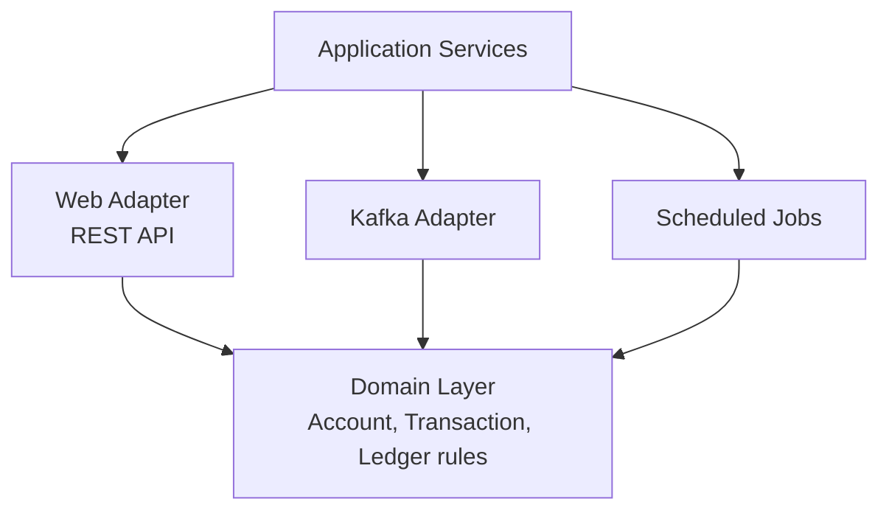

## Contexto Regulatorio

Una fintech B2B que procesa pagos entre empresas debe cumplir con PSD2 (autenticación fuerte del cliente),
GDPR (derecho al olvido) y mantener trazabilidad auditada de cada movimiento contable. Esto descarta
arquitecturas eventualmente consistentes para el core transaccional.

## Arquitectura Hexagonal

El dominio no conoce Spring, Hibernate ni Kafka. Esto permite testear las reglas contables en milisegundos
y cambiar adaptadores sin tocar la lógica de negocio.

## Decisiones Técnicas Clave

- **Transactions explícitas:** `@Transactional` solo en la capa de aplicación; el dominio nunca abre
  transacciones.
- **Kafka para auditoría:** cada comando que muta estado produce un evento a Kafka, que un consumer
  independiente persiste en una base de datos de auditoría inmutable.
- **Flyway para migraciones:** versionado estricto del schema, sin rollback automático (las migraciones
  son siempre forward-only).
- **OAuth2 resource server:** la API valida JWTs emitidos por el IdP corporativo, con claims `scope`
  mapeados a authorities de Spring Security.

## Resultados y Aprendizajes

El sistema procesa 50.000 transacciones/día con **cero errores de conciliación** en 12 meses. La latencia
p99 de los endpoints críticos es 80ms. Pasó la auditoría PSD2 en la primera revisión, gracias a la
trazabilidad completa en Kafka. La reducción de costes de infraestructura fue del 70% respecto al sistema
PHP anterior, principalmente porque la JVM maneja mucho mejor la concurrencia que PHP-FPM.
