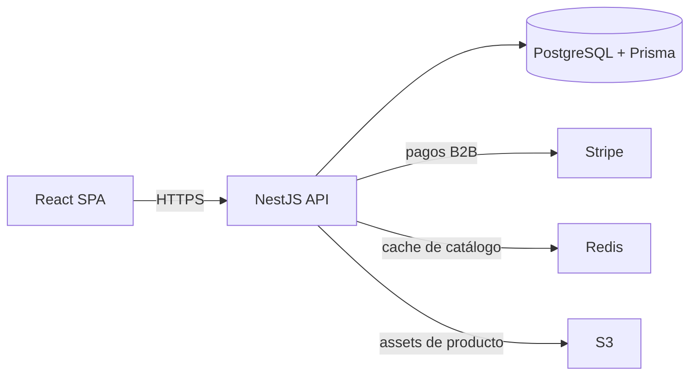

## Contexto del Cliente

El cliente es un distribuidor B2B con más de 800 compradores corporativos activos. Cada comprador tiene precios
negociados por contrato, listas personalizadas de productos y plazos de pago diferentes. La gestión manual
provocaba inconsistencias entre lo que veía el cliente y lo que facturaba el ERP.

## Arquitectura Técnica

El backend NestJS está dividido en módulos: `auth`, `catalog`, `pricing`, `orders`, `payments`. Cada módulo
expone su propio DTO con validación `class-validator` y se integra a un sistema de eventos interno para
desacoplar efectos secundarios (auditoría, notificaciones, sync con ERP).

## Decisiones Clave

- **Pricing dinámico:** el precio final se calcula por request combinando contrato + volumen + promociones
  vigentes, cacheado en Redis con TTL de 60s.
- **Auth por cuenta:** JWT con claims `accountId` y `role`; los guards de NestJS validan permisos a nivel
  de endpoint y de recurso.
- **Catálogo versionado:** cada cambio de precio genera una nueva fila con `validFrom`/`validTo`, lo que
  permite regenerar facturas históricas.

## Resultados y Aprendizajes

La migración fue por fases: primero catálogo, luego pedidos y finalmente pagos. El mayor aprendizaje fue
que **el pricing dinámico requiere un modelo de datos pensado para auditoría desde el día uno**; refactorizar
esto a posteriori es muy costoso. El rendimiento fue excelente incluso con 12.000 referencias gracias al
cache y a índices PostgreSQL bien diseñados.
