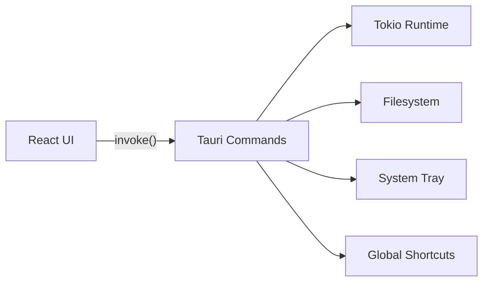

## El Problema de las Apps Desktop Modernas

La mayoría de aplicaciones desktop cross-platform modernas usan Electron, que empaqueta un Chromium completo.
Esto genera binarios de 100-200MB y consumos de RAM excesivos. Para una herramienta de productividad que vive
en el system tray, este coste es inaceptable.

## Solución con Tauri + Rust

Tauri usa el webview nativo del sistema operativo (WebView2 en Windows, WKWebView en macOS, WebKitGTK en Linux),
lo que reduce el binario a lo esencial. El backend Rust se encarga de toda la lógica del sistema:

```rust
#[tauri::command]
async fn index_notes(path: String) -> Result<Vec<Note>, String> {
    let mut notes = Vec::new();
    for entry in fs::read_dir(&path).map_err(|e| e.to_string())? {
        let entry = entry.map_err(|e| e.to_string())?;
        // indexación async con Tokio
        notes.push(parse_note(entry.path()).await?);
    }
    Ok(notes)
}
```

El frontend React se comunica con Rust vía comandos Tauri tipados, lo que da type-safety end-to-end.

## Arquitectura



## Resultados

- **Tamaño binario:** 8MB (Windows), 12MB (macOS), 10MB (Linux)
- **RAM en idle:** 45MB vs 200-400MB típicos en Electron
- **Arranque:** `<200ms`
- **Instalaciones:** 1.500+ en 3 meses, todo orgánico
